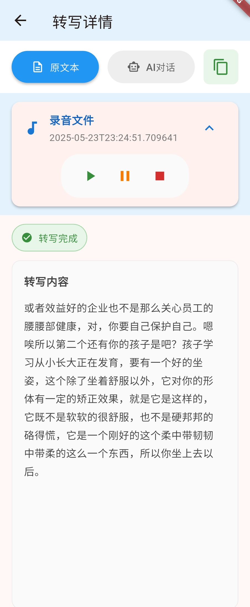
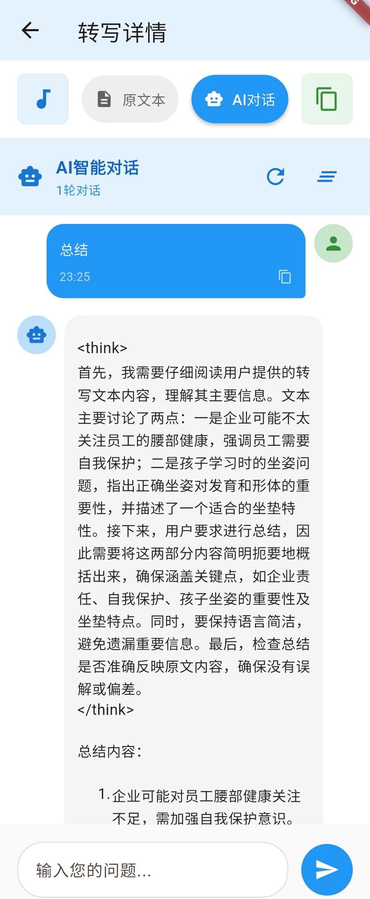

# ClipText

一个安卓音频、视频声音内录转文字APP。转换的文本可以进一步与AI进行对话，直接生成总结、分析、提取要点等。

亦可以作为学习使用dart开发简单应用的模板案例，代码百分百使用cursor自动生成。

## 主要功能点

### 🎙️ 系统音频录制
- **悬浮窗录制**：支持系统级悬浮窗录音，可录制任意应用的音频输出
- **内录功能**：录制系统音频、视频声音、通话音频等
- **后台录制**：支持后台持续录制，不影响其他应用使用
- **多格式支持**：录制为WAV格式，保证音质

### 📝 智能语音转文字
- **讯飞语音识别**：集成讯飞语音转写API，支持高精度中文识别
- **批量转写**：支持批量提交音频文件进行转写
- **实时查询**：自动轮询转写结果，支持长音频处理
- **离线存储**：转写结果本地存储，支持离线查看

### 🤖 AI智能对话
- **ChatGPT集成**：支持OpenAI API和兼容接口
- **上下文理解**：基于转写文本进行智能问答
- **多种AI任务**：
  - 📋 内容总结与提取要点
  - 🔍 关键信息分析
  - ❓ 智能问答
  - 📊 数据整理
  - ✍️ 文本润色
- **对话历史**：保存AI对话记录，支持历史回顾
- **Markdown渲染**：AI回复支持Markdown格式显示

### 📚 文本库管理
- **分类管理**：按录音来源和时间分类管理转写文本
- **搜索功能**：支持全文搜索，快速定位内容
- **编辑功能**：支持文本编辑和标注
- **导出分享**：支持文本复制和分享

### 🎵 音频播放
- **内置播放器**：支持录音文件播放和进度控制
- **播放状态管理**：显示播放进度、时长等信息
- **音频信息**：显示文件大小、时长、格式等详细信息

### ⚙️ 系统设置
- **API配置**：
  - 讯飞语音转写API配置（AppID、SecretKey）
  - OpenAI API配置（API Key、Base URL、模型选择）
- **权限管理**：自动申请和管理录音、存储等权限
- **数据管理**：支持数据备份和清理

### 🔧 技术特性
- **Flutter跨平台**：基于Flutter框架，支持Android平台
- **原生插件**：自研system_audio_recorder插件实现系统音频录制
- **本地存储**：使用SQLite和SharedPreferences进行数据持久化
- **网络请求**：支持HTTP/HTTPS API调用
- **Material Design**：遵循Material Design 3设计规范

### 📱 用户体验
- **直观界面**：底部导航栏设计，功能分区清晰
- **实时反馈**：操作状态实时显示，加载进度可视化
- **错误处理**：完善的异常处理和用户提示
- **响应式设计**：适配不同屏幕尺寸

## 功能简介

### 1. 录音


### 2. 录音列表

<div style="display: flex; gap: 20px; flex-wrap: wrap;">
  
  
</div>

### 3. 文本库

<div style="display: flex; gap: 20px; flex-wrap: wrap;">
  
  
  
</div>

### 4. 设置


## 运行与调试

### 1. 安装依赖

```bash
flutter pub get
```

### 2. 连接设备或启动模拟器
- 连接一台 Android 设备（推荐 Android 10 及以上，已开启开发者模式和 USB 调试）。
- 或在 Android Studio/VS Code 启动 Android 模拟器。

### 3. 运行项目

```bash
flutter run
```

如有多个设备，先用 `flutter devices` 查看设备ID，再用：

```bash
flutter run -d <设备ID>
```

### 4. 构建Release版本

使用提供的构建脚本可以自动构建并重命名APK文件：

```bash
./build_release.sh
```

或者手动构建：

```bash
flutter build apk --release
```

构建完成后，APK文件将位于 `build/app/outputs/flutter-apk/` 目录下，文件名格式为 `clip-text-版本号.apk`（如：`clip-text-0.1.0.apk`）。

### 5. 注意事项
- **权限**：首次运行时，应用会请求录音、投屏等权限，请务必全部允许。
- **Android 14 及以上**：需在 `AndroidManifest.xml` 中声明 `android.permission.FOREGROUND_SERVICE_MEDIA_PROJECTION` 和 `android.permission.CAPTURE_VIDEO_OUTPUT`，本项目已配置。
- **录音功能**：如需录制系统音频，需在真机或支持音频投屏的模拟器上运行，部分模拟器可能不支持。
- **热重载/重启**：开发过程中可用 `r`（热重载）或 `R`（热重启）提升效率。

### 6. 常用命令

- 清理构建缓存
  ```bash
  flutter clean
  flutter pub get
  ```
- 查看日志
  ```bash
  flutter logs
  ```

## API服务

### 讯飞录音文件转写

https://console.xfyun.cn/services/lfasr

### ChatGPT接口

https://gptgod.online/
