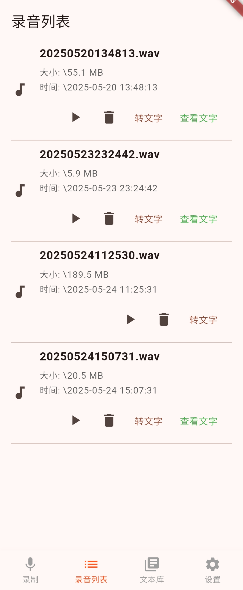
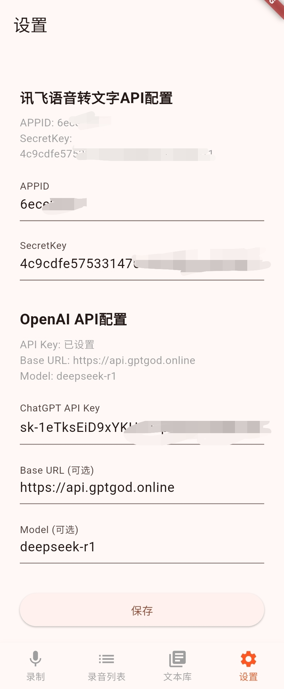

# ClipText

一个安卓音频、视频声音内录转文字APP。转换的文本可以进一步与AI进行对话，直接生成总结、分析、提取要点等。

亦可以作为学习使用dart开发简单应用的模板案例，代码百分百使用cursor自动生成。

## 功能简介

### 1. 录音


### 2. 录音列表

<div style="display: flex; gap: 20px; flex-wrap: wrap;">
  
  
</div>

### 3. 文本库

<div style="display: flex; gap: 20px; flex-wrap: wrap;">
  
  
  
</div>

### 4. 设置



## 运行与调试

### 1. 安装依赖

```bash
flutter pub get
```

### 2. 连接设备或启动模拟器
- 连接一台 Android 设备（推荐 Android 10 及以上，已开启开发者模式和 USB 调试）。
- 或在 Android Studio/VS Code 启动 Android 模拟器。

### 3. 运行项目

```bash
flutter run
```

如有多个设备，先用 `flutter devices` 查看设备ID，再用：

```bash
flutter run -d <设备ID>
```

### 4. 注意事项
- **权限**：首次运行时，应用会请求录音、投屏等权限，请务必全部允许。
- **Android 14 及以上**：需在 `AndroidManifest.xml` 中声明 `android.permission.FOREGROUND_SERVICE_MEDIA_PROJECTION` 和 `android.permission.CAPTURE_VIDEO_OUTPUT`，本项目已配置。
- **录音功能**：如需录制系统音频，需在真机或支持音频投屏的模拟器上运行，部分模拟器可能不支持。
- **热重载/重启**：开发过程中可用 `r`（热重载）或 `R`（热重启）提升效率。

### 5. 常用命令

- 清理构建缓存
  ```bash
  flutter clean
  flutter pub get
  ```
- 查看日志
  ```bash
  flutter logs
  ```

如遇到任何编译或运行问题，请将报错信息贴出来，我会帮你分析解决！
